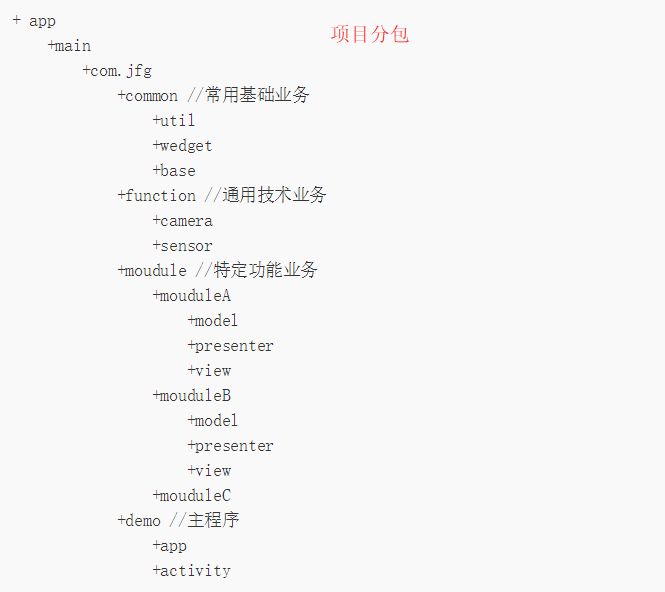

```java
/**  
 * bitmap转为base64  
 * @param bitmap  
 * @return  
 */    
public static String bitmapToBase64(Bitmap bitmap) {    
    
    String result = null;    
    ByteArrayOutputStream baos = null;    
    try {    
        if (bitmap != null) {    
            baos = new ByteArrayOutputStream();    
            bitmap.compress(Bitmap.CompressFormat.JPEG, 100, baos);    
    
            baos.flush();    
            baos.close();    
    
            byte[] bitmapBytes = baos.toByteArray();    
            result = Base64.encodeToString(bitmapBytes, Base64.DEFAULT);    
        }    
    } catch (IOException e) {    
        e.printStackTrace();    
    } finally {    
        try {    
            if (baos != null) {    
                baos.flush();    
                baos.close();    
            }    
        } catch (IOException e) {    
            e.printStackTrace();    
        }    
    }    
    return result;    
}    
    
/**  
 * base64转为bitmap  
 * @param base64Data  
 * @return  
 */    
public static Bitmap base64ToBitmap(String base64Data) {    
    byte[] bytes = Base64.decode(base64Data, Base64.DEFAULT);    
    return BitmapFactory.decodeByteArray(bytes, 0, bytes.length);    
}
```
- - - 
```java
//ScrollView嵌套WebView（ViewPager等）冲突解决
webView.setOnTouchListener(new View.OnTouchListener() {
            @Override
            public boolean onTouch(View view, MotionEvent motionEvent) {
                switch (motionEvent.getAction()) {
                    case MotionEvent.ACTION_DOWN:
                    case MotionEvent.ACTION_MOVE:
                        scrollView.requestDisallowInterceptTouchEvent(true);
                        break;
                    case MotionEvent.ACTION_UP:
                        scrollView.requestDisallowInterceptTouchEvent(false);
                        break;
                }
                return false;
            }
        });
```
- - - 
```java
 /**
  * EditText设置编辑和不可编辑，相互切换
  *①在xml中设置属性 focusable="false"；
  *②可编辑代码
  */
	editText.setFocusableInTouchMode(true);
	editText.setFocusable(true);
	editText.requestFocus();
    //不可编辑代码：
	editText.setFocusable(false);
	editText.setFocusableInTouchMode(false);
```
- - - 
```java
/**
 * 毫秒值（long）转指定日期格式
 */	
SimpleDateFormat simple = new SimpleDateFormat("yyyy年MM月dd日 HH:mm");
Date date = new Date(Long.parseLong("时间字符串"));
String time = simple.format(date);
```
- - - - -
```java
/**
 * 获取本地时间，显示指定格式
 */
SimpleDateFormat simple = new SimpleDateFormat("yyyy年MM月dd日");
Date date = new Date(System.currentTimeMillis());
String currentTime = simple.format(date);
```
- - - - -
```xml
/**
 * Android 5.0以上版本去掉 Button 自带阴影效果
 */
 <Button
    android:layout_width="wrap_content"
    android:layout_height="wrap_content"
    android:text="@string/button_send"
    android:onClick="sendMessage"
    style="?android:attr/borderlessButtonStyle" />
    
    // 核心代码
    style=”?android:attr/borderlessButtonStyle”
```
- - - - -
```java
// Gson 解析返回一个 List  
String str="[{'id': '1','code': 'bj','name': '北京','map': '39.90403, 116.40752599999996'}, {'id': '2','code': 'sz','name': '深圳','map': '22.543099, 114.05786799999998'}, {'id': '9','code': 'sh','name': '上海','map': '31.230393,121.473704'}, {'id': '10','code': 'gz','name': '广州','map': '23.129163,113.26443500000005'}]";  
  
Gson gson = new Gson();  
List<City> rs = new ArrayList<City>();  
Type type = new TypeToken<ArrayList<City>>() {}.getType();  
rs=gson.fromJson(str, new TypeToken<ArrayList<City>>(){}.getType());  

// Gson 解析返回一个map
 String jsonStr="{'1': {'id': '1','code': 'bj','name': '北京','map': '39.90403, 116.40752599999996'},'2': {'id': '2','code': 'sz','name': '深圳','map': '22.543099, 114.05786799999998'},'9': {'id': '9','code': 'sh','name': '上海','map': '31.230393,121.473704'},'10': {'id': '10','code': 'gz','name': '广州','map': '23.129163,113.26443500000005'}}";  
  
Map<String, City> citys = gson.fromJson(jsonStr, new TypeToken<Map<String, City>>(){}.getType());   
```
- - - - -
```java
private static final String moblie1 = "^(0\\d{2,3}-\\d{7,8}(-\\d{3,5}){0,1})|(((13[0-9])|(15([0-3]|[5-9]))|(18[0-9])|(17[0-9])|(14[0-9]))\\d{8})$";
private static final String moblie2 = "^(((13[0-9])|(15([0-3]|[5-9]))|(18[0-9])|(17[0-9])|(14[0-9]))\\d{8})$";

/**
 * 验证手机号是否匹配
 *
 * @param phone
 * @param isPhone：是否支持固话验证
 * @return ：true 手机号是正确的，false 手机号不正确
 */
public static boolean mobilePhone(String phone, boolean isPhone) {
    String regStr;
    if (isPhone == true) {
        regStr = moblie1;
    } else {
        regStr = moblie2;
    }
    return phone == null || phone.trim().equals("") ? false : phone.replaceAll(regStr, "").equals("");
}
```
- - - - -
```java
private static final String email = "^([a-zA-Z0-9_\\-\\.]+)@((\\[[0-9]{1,3}\\.[0-9]{1,3}\\.[0-9]{1,3}\\.)|(([a-zA-Z0-9\\-]+\\.)+))([a-zA-Z]{2,4}|[0-9]{1,3})(\\]?)$";

/**
 * 判断邮箱是否合法
 *
 * @param email
 * @return
 */
public static boolean isEmail(String email) {
    if (isEmpty(email))
        return false;
    Pattern p = Pattern.compile(StringUtil.email);
    Matcher m = p.matcher(email);
    return m.matches();
}
```
- - - - -
```java
// 解决华为手机调试看不到报错信息方法：
// 拨号键盘输入*#*#2846579#*#*，然后选择ProhectMenu,然后后台设置，然后LOG设置，LOG打开。 
```
- - - - -
```java
// Popwindow 设置背景图片（带尖角）边缘有阴影，去掉阴影做法：
// 在代码中给 pop 设置 backgroundDrawable 为系统的透明颜色或者下面方式都可以.
/** 
 * 生成一个 透明的背景图片 
 * @return 
 */
private Drawable getDrawable(){  
        ShapeDrawable bgdrawable =new ShapeDrawable(new OvalShape());  
        bgdrawable.getPaint().setColor(MainActivity.this.getResources().getColor(android.R.color.transparent));  
        return   bgdrawable;  
}
```
- - - - -
```java
/**
 *  Dialog 代码中设置大小，需在 show() 之后设置如下代码才会生效
 *
 */
WindowManager.LayoutParams params = dialog.getWindow().getAttributes();
params.width = 200;
params.height = 200 ;
dialog.getWindow().setAttributes(params);
```
- - - - -
```java
// ScrollView 嵌套 ListView ，页面打开时，默认没有显示在顶部，解决办法：
// 在代码中给 ListView 设置如下代码即可：
listview.setFocusable(false);
```
- - - - -
```xml
/**
 * 列表式界面（顶部输入框，底部列表）结构，
 * 解决打开界面自动弹出软键盘方法之一：在其对应的 Manifest.xml 文件中添加如下代码即可：
 */
android:windowSoftInputMode="stateAlwaysHidden"
```
- - - - -
```java
/**
 * RecyclerView 的 item 最外层布局使用 CardView 时,CardView 没有占满屏幕宽度是因为 item 布局加载方式不对
 * 推荐笔记：http://blog.chengdazhi.com/index.php/110 
 */
// View view = View.inflate(mContext, R.layout.item_rv, null); // 不能铺满
View view = LayoutInflater.from(mContext).inflate(R.layout.item_rv, parent, false); // 铺满
```
- - - - -




如上所示，我们根据开始的项目业务拆分分包如上，将常用的基础业务放到common包里边，这个包在大多数情况是不变的，并且为app提供基础性的服务，不过我们尽量不要放到这个common包里边，如果这个common包变得足够大的时候，就一定要思考是不是该拆分了。因为common给人的感觉就是什么都是，那就让我们无法快速认知这个包所担当的职责。我们可以这样理解，common包是面向切面而设计的一些业务，但也不是绝对的。接下来我们先聊module这个包，实际这里是将业务进行了模块化的分拆，如上我们拆分出了moudleA和moudleB，这两者之间要求没有任何的联系。但是，我们会存在一个问题，那就是moudleA和moudleB某些业务是一样的，我们拆开显得重复了许多体力活。这应该是大多数开发者面对的困扰，这种该怎么去平衡呢？我是这么考虑的。如果，moudle和moudleB存在重叠的业务，我们将这些业务提取到function包或者common包中，这样降低了业务的层级。我们允许moudle包的各模块业务依赖于function和common为我们提供的基础服务。为了更好的区分模块A和模块B虽然重叠但在逻辑上是各自属于各自的，我们有两种方法来做。第一种是将两种业务进行一定的抽象，实现的过程还是放到各个moudle业务中。第二种方案定义两个接口类，各自定义各自的接口。在具体的实现类中实现了这两个接口类的方法，内部在进行相同的逻辑操作。这样，对外看来，逻辑上moudleA和moduleB是分离的。总之，如何分包还得权衡利弊，尽量以一种思维来进行划分，以避免设计混乱。
- - - - -
```java
/**
 * 获取视频的缩略图
 * <p>
 * 先通过ThumbnailUtils来创建一个视频的缩略图，然后再利用ThumbnailUtils来生成指定大小的缩略图。
 * 如果想要的缩略图的宽和高都小于MICRO_KIND，则类型要使用MICRO_KIND作为kind的值，这样会节省内存。
 *
 * @param videoPath 视频的路径
 * @param width     指定输出视频缩略图的宽度
 * @param height    指定输出视频缩略图的高度度
 * @param kind      参照MediaStore.Images.Thumbnails类中的常量MINI_KIND和MICRO_KIND。
 *                  其中，MINI_KIND: 512 x 384，MICRO_KIND: 96 x 96
 * @return 指定大小的视频缩略图
 */
private Bitmap getVideoThumbnail(String videoPath, int width, int height,
                                 int kind) {
    Bitmap bitmap = null;
    // 获取视频的缩略图
    bitmap = ThumbnailUtils.createVideoThumbnail(videoPath, kind);
    bitmap = ThumbnailUtils.extractThumbnail(bitmap, width, height,
            ThumbnailUtils.OPTIONS_RECYCLE_INPUT);
    return bitmap;
}
```
- - - - -
```java
/**
     * 从系统文件管理获取选择的文件路径
     *
     * @param context
     * @param uri
     * @return
     */
    private String getFmPath(Context context, Uri uri) {
        if ("content".equals(uri.getScheme())) {
            String[] projection = {"_data"};
            Cursor cursor = null;
            try {
                cursor = context.getContentResolver().query(uri, projection, null, null, null);
                int column_index = cursor.getColumnIndexOrThrow("_data");
                if (cursor.moveToFirst()) {
                    return cursor.getString(column_index);
                }
            } catch (Exception e) {

            }
        } else if ("file".equalsIgnoreCase(uri.getScheme())) {
            return uri.getPath();
        }
        return null;
    }
```
- - - - -
```java
获取手机IP

1.使用WIFI

添加权限
<uses-permission android:name="android.permission.ACCESS_WIFI_STATE"></uses-permission>  
<uses-permission android:name="android.permission.CHANGE_WIFI_STATE"></uses-permission>  
<uses-permission android:name="android.permission.WAKE_LOCK"></uses-permission>

代码：
    public void onCreate(Bundle savedInstanceState) {  
            super.onCreate(savedInstanceState);  
            setContentView(R.layout.main);  
             
            //获取wifi服务  
            WifiManager wifiManager = (WifiManager) getSystemService(Context.WIFI_SERVICE);  
            //判断wifi是否开启  
            if (!wifiManager.isWifiEnabled()) {  
            wifiManager.setWifiEnabled(true);    
            }  
            WifiInfo wifiInfo = wifiManager.getConnectionInfo();       
            int ipAddress = wifiInfo.getIpAddress();   
            String ip = intToIp(ipAddress);   
            EditText et = (EditText)findViewById(R.id.EditText01);  
            et.setText(ip);  
        }     
        private String intToIp(int i) {
              return (i & 0xFF ) + "." +       
            ((i >> 8 ) & 0xFF) + "." +       
            ((i >> 16 ) & 0xFF) + "." +       
            ( i >> 24 & 0xFF) ;  
         }
此方法是没有问题的，Android 高低版本都合适

2、使用GPRS

权限：
<uses-permission android:name="android.permission.INTERNET"></uses-permission>  
代码：
//获取本地IP
 public static String getLocalIpAddress() {  
    try {  
        for (Enumeration<NetworkInterface> en = NetworkInterface  
                        .getNetworkInterfaces(); en.hasMoreElements();) {  
                    NetworkInterface intf = en.nextElement();  
                   for (Enumeration<InetAddress> enumIpAddr = intf  
                            .getInetAddresses(); enumIpAddr.hasMoreElements();) {  
                        InetAddress inetAddress = enumIpAddr.nextElement();  
                        if (!inetAddress.isLoopbackAddress() && !inetAddress.isLinkLocalAddress()) {  
                        return inetAddress.getHostAddress().toString();  
                        }  
                   }  
                }  
            } catch (SocketException ex) {  
                Log.e("WifiPreference IpAddress", ex.toString());  
            } 
         return null; 
}
```
- - - - -
```java
/**
 * X5 WebView 如下设置,加载 word 或者其他网页链接 在退出页面时出现异常的解决办法：onDestroy 方法
 */
WebView x5WebView = new WebView(this);

WebSettings webSettings = x5WebView.getSettings();
webSettings.setAllowFileAccess(true);
webSettings.setSupportZoom(true);
webSettings.setUseWideViewPort(true);
webSettings.setLayoutAlgorithm(WebSettings.LayoutAlgorithm.NARROW_COLUMNS);
webSettings.setLoadWithOverviewMode(true);
webSettings.setBuiltInZoomControls(true);
webSettings.setSupportMultipleWindows(true);
webSettings.setAppCacheEnabled(true);
webSettings.setDomStorageEnabled(true);

/**
* 在页面的生命周期方法 onDestroy 做如下判断即可
*/
@Override
protected void onDestroy() {
    if (x5WebView != null) {
        x5WebView.getSettings().setBuiltInZoomControls(true);
        x5WebView.removeAllViews();
        x5WebView.setVisibility(View.GONE);
        x5WebView.destroy();
    }
super.onDestroy();
}
```
- - - - -
